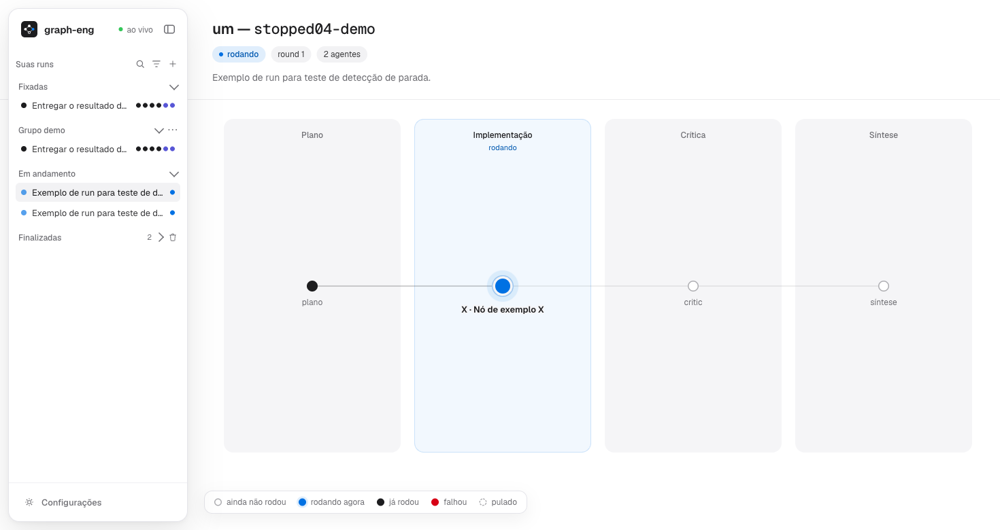

<p align="center">
  <picture>
    <source media="(prefers-color-scheme: dark)" srcset="docs/assets/logo-dark.svg">
    <source media="(prefers-color-scheme: light)" srcset="docs/assets/logo-light.svg">
    
  </picture>
</p>

<h1 align="center">graph-eng</h1>

<p align="center">
  <em>Tarefa complexa vira um grafo pequeno de agentes: executor barato, revisor forte, e você acompanha — e agora também age — ao vivo.</em>
</p>

<p align="center">
  <a href=".claude-plugin/plugin.json"></a>
  <a href="LICENSE"></a>
  <a href="#instalação"></a>
  <a href="#requisitos"></a>
  <a href="package.json"></a>
</p>

<p align="center">
  <a href="#instalação">Instalação</a> ·
  <a href="#uso">Uso</a> ·
  <a href="#painel">Painel</a> ·
  <a href="#ações-sobre-uma-run">Ações</a> ·
  <a href="#esforço-e-teto-de-agentes">Esforço e teto</a> ·
  <a href="#faq">FAQ</a> ·
  <a href="skills/graph-eng/DESIGN.md">Por que o desenho é este</a>
</p>

---

## O que é

`graph-eng` é um plugin do Claude Code que roda uma tarefa complexa como um **grafo pequeno de
agentes**, com um **esqueleto de fases obrigatório por modo** (implement passa por Design → Revisão do
design → Implementação → Síntese; architecture não chega a implementar; research/review vão a Plano →
Pesquisa → Crítica → Síntese):

```
PLAN ─▶ PESQUISA ─▶ DESIGN ─▶ REVISÃO DO DESIGN ─▶ [ DAG: work ─▶ gate de checks ─▶ verify ⇄ repair ] ─▶ CRITIC ─┬─ done ──▶ SÍNTESE (polidores + consolidador) ─▶ gate humano
                                    ▲                                                                            │
                                    └─────────────────────────── gaps = novos nós ─────────────────────────────┘   (até maxRounds, ou sem gap novo)
```

<p align="center">
  <picture>
    <source media="(prefers-color-scheme: dark)" srcset="docs/assets/painel-dark.png">
    <source media="(prefers-color-scheme: light)" srcset="docs/assets/painel-light.png">
    
  </picture>
</p>

Em dois comandos:

```
/plugin marketplace add Dougladmo/graph-eng
/plugin install graph-eng@graph-eng
```

```
/graph-eng:graph-eng implement "descreva a tarefa aqui"
```

A **regra é executor barato, revisor forte**: workers em Sonnet; planner, verificador e critic no
modelo da sessão. Leitura roda em paralelo. Escrita roda em paralelo só quando os nós declaram arquivos
disjuntos; se os arquivos se sobrepõem, fica em raia única. Toda implementação é verificada por outro
agente, com uma lente de boas práticas no verify e na crítica; o 2º voto só entra quando o verificador
fica em dúvida; o design é revisado antes de implementar — reprovado, não implementa. O quanto o grafo
gasta é o **esforço** (`manual`/`auto`/`low`/`medium`/`high`/`max`) contra um **teto** de agentes
(padrão de fábrica: `ceiling` 24 e `effort` auto, vale sem nenhuma configuração). A fundamentação de
cada decisão, com fontes, está em [skills/graph-eng/DESIGN.md](skills/graph-eng/DESIGN.md).

**Quando usar:** feature, refatoração, arquitetura de sistema ou investigação profunda que se beneficia
de separar quem trabalha de quem confere. **Quando não usar:** tarefa de um passo, ou trabalho muito
sequencial com muito contexto compartilhado (debugar um fluxo) — faça direto na sessão, ou use
`economy: 'lean'`.

O workflow **nunca** faz commit, push, deploy nem migration remota. Isso fica no gate humano.

## Requisitos

- Claude Code com **dynamic workflows**. Disponíveis em todos os planos pagos e com acesso pela API. No
  plano Pro, ligue a linha **Dynamic workflows** em `/config`.
- `node` no `PATH`. O painel e a config rodam em Node puro, sem `npm install`. Testado no Node 22.

## Instalação

Só Claude Code — sem seção para Codex, Gemini ou outro agente.

### Numa sessão do Claude Code

Rode os dois comandos, um de cada vez:

```
/plugin marketplace add Dougladmo/graph-eng
```

```
/plugin install graph-eng@graph-eng
```

O segundo abre os detalhes do graph-eng no painel do `/plugin`. Escolha o escopo — **Install for you**
vale para todos os seus projetos. Se aparecer `Run /reload-plugins to activate.`, rode `/reload-plugins`.

### Pelo terminal

```bash
claude plugin marketplace add Dougladmo/graph-eng
claude plugin install graph-eng@graph-eng
```

Instala para o seu usuário. Com `--scope project`, ativa para quem trabalha no repositório. O plugin
carrega na próxima sessão, ou depois de `/reload-plugins` numa sessão já aberta.

### Conferir

Digite `/` numa sessão: `/graph-eng:graph-eng` aparece na lista. No terminal, `claude plugin list`
mostra `graph-eng@graph-eng`.

### Atualizar

Marketplace de terceiros vem com a atualização automática desligada. Para atualizar, no terminal:

```bash
claude plugin marketplace update graph-eng
claude plugin update graph-eng@graph-eng
```

Numa sessão aberta, rode `/reload-plugins` depois. Ou pela interface: `/plugin` → aba **Installed** →
**Update now** no graph-eng → `/reload-plugins`.

### Desinstalar

```
/plugin uninstall graph-eng@graph-eng
```

Pelo terminal: `claude plugin uninstall graph-eng@graph-eng`. Isso remove o plugin, mas não o que ele
grava fora da pasta dele: `~/.claude/graph-eng/` (config, fila de pedidos, organização da lista) e a
pasta `.graph-runs/` de cada repositório. Apague à mão se quiser.

## Uso

```
/graph-eng:graph-eng [--lean|--max] [--effort <manual|auto|low|medium|high|max>] [--ceiling <N>]
  [--plan-gate] [--spec <arquivo>] [research|architecture|implement|review] <tarefa>
```

A skill também dispara sozinha quando você pede "grafo", "graph eng" ou "roda em loop até ficar pronto"
para uma tarefa complexa. Ela faz um scout barato, lê a config efetiva com
`node "${CLAUDE_PLUGIN_ROOT}/bin/graph-config.mjs" --json`, monta o `context` e chama o workflow
`graph-eng:graph-eng`. O paper trail de cada run fica em `<repo>/.graph-runs/<runId>/` (plano, artefatos
por nó, `REPORT.md`), e o `INDEX.md` guarda a memória entre runs.

| Preset     | Modelos                    | Quando                                    |
| ---------- | --------------------------- | ------------------------------------------ |
| `lean`     | Sonnet também no design    | tarefa média, custo mínimo                 |
| `balanced` | Sonnet nos workers          | padrão                                     |
| `max`      | tudo no modelo da sessão    | tarefa crítica                             |

O teto e a largura não vêm do preset — ver [Esforço e teto de agentes](#esforço-e-teto-de-agentes).

## Painel

A skill sempre sobe o painel web e imprime o id da run (`wf_…`) e o link ao vivo:

```bash
node "${CLAUDE_PLUGIN_ROOT}/bin/graph-watch.mjs" ui
# imprime "graph-eng: painel: http://127.0.0.1:<porta>"; abra "<url>/?run=<wf>" para uma run
```

Roda em `127.0.0.1`, com **uma instância por máquina**: se a porta já tem um `graph-watch ui` no ar, o
comando novo sai na hora reaproveitando ele. A porta padrão é 4477; troque com `--port <N>` ou com a
variável `GRAPH_ENG_PORT` (a flag vence a variável). Para a skill usar outra porta sempre, fixe no
`~/.claude/settings.json`:

```json
{ "env": { "GRAPH_ENG_PORT": "5177" } }
```

Cada nó do grafo mostra uma bolinha — piscando quando está rodando agora, preenchida quando já rodou
(vermelha se falhou) e vazia quando ainda não rodou. A lista lateral mostra as runs da máquina,
organizada como no Claude Code (ver [Lista de runs](#lista-de-runs-fixadas-grupos-arquivadas)), e clicar
num nó abre o detalhe (prompt, ferramentas recentes, resultado). Antes da 0.5.0 o painel só lia; agora
também **age** sobre a run — ver a seção seguinte.

Um nó que não terminou verificado mostra o **motivo**, tirado só dos arquivos da run (journal, veredito
do verificador, revisão do design) e nunca inventado: `pulado` (sem orçamento, ou a run terminou antes),
`falhou`, `falhou (check)` (o comando de conferência do nó), `bloqueado` (o worker ou o motor sinalizou
bloqueio) e `sem reverificação` (reparo sem 2ª verificação). Aparece no `title` e no `aria-label` da
bolinha (passe o mouse ou navegue por teclado), na gaveta de detalhe do nó, e nas duas saídas em texto do
`graph-watch` — `events`, na linha de marco final, e `snapshot`, no bloco `motivos:` depois do layout em
caixas. O favicon do painel usa o mesmo logo do cabeçalho: PNG de 32px e `apple-touch-icon.png` gerados
uma vez e versionados, porque o Safari não mostra favicon SVG; `/favicon.ico` devolve esse PNG (antes
respondia 204, sem ícone nenhum).

## Ações sobre uma run

O painel pode retomar uma run parada, parar uma run, refazer um nó (com a opção de arrastar os
dependentes) e mostrar os artefatos — mas o painel é um processo à parte do Workflow, então ele nunca
executa a ação direto: ele **pede**, e a sessão do Claude que está ouvindo **executa**. Por isso cada
ação depende de haver uma sessão ouvindo (ver abaixo); sem ela, sobra o botão **Copiar comando**, que
funciona sempre.

### Como o pedido chega até a sessão

1. O painel grava o pedido — `resume`, `stop` ou `rerun-node` — numa fila em arquivo
   (`~/.claude/graph-eng/requests/`), gravação atômica.
2. A skill deixa o `graph-watch events` rodando em segundo plano no Monitor
   (`skills/graph-eng/SKILL.md`, "Ações sobre uma run"); cada linha nova vira um evento para o Claude.
   `events` também grava o sinal de vida do watcher a cada 10s.
3. O Claude lê o pedido pela linha do evento, decide o que fazer (ver a tabela abaixo) e grava o estado
   de volta com `bin/requests.mjs` (`accept`/`done`/`fail`), que o painel mostra em tempo real por SSE.

| Tipo         | Quem atende                                                                 | O que a sessão faz                                                                           |
| ------------ | ------------------------------------------------------------------------------ | ------------------------------------------------------------------------------------------------|
| `resume`     | a 1ª sessão ouvindo no mesmo projeto (exceto: run parada com a dona ouvindo)   | roda `bin/graph-resume.mjs` para montar `args.resume` e dispara o `Workflow(...)` de retomada   |
| `rerun-node` | idem                                                                            | mesmo CLI, com `--rerun <id> [--dependents]`                                                    |
| `stop`       | só a sessão **dona** da run                                                    | `TaskStop(task_id)` da task do Workflow em execução                                             |

`stop` é sempre da sessão dona porque `TaskStop` só alcança task da própria sessão. A exceção de
`resume`/`rerun-node` para a dona existe porque uma run "parada" pode ser falso positivo (seção
seguinte) — nesse caso, disparar de outra sessão duplicaria a execução; só a dona sabe parar a antiga
antes de subir a nova.

Depois do `TERMINADO`, a sessão segue ouvindo por **2 h** (o Monitor é rearmado até 4 vezes sem avisar
você). Passado isso, ou sem nenhuma sessão nunca tendo ouvido essa run, o painel mostra "nenhuma sessão
ouvindo" e os botões de ação ficam desabilitados, com o motivo — sobra o **Copiar comando**.

### Copiar comando

Os botões **Copiar para retomar**, **Copiar para refazer `<nó>`** e **Copiar para parar** colocam no
clipboard o texto exato para colar numa sessão do Claude Code, mesmo sem nenhuma sessão ouvindo. Colar
faz a retomada certa sem nenhuma pergunta extra — é o mesmo caminho que a sessão ouvinte roda sozinha.

### Motor retomável

`workflows/graph-eng.js` aceita pelos args os nós já prontos (`args.resume.done`, com veredito e
resultado) e a lista de nós a refazer, com a opção de arrastar os dependentes. Um nó pronto que **não**
está na lista de refazer não gera agente nenhum: o motor entra com o resultado gravado direto, sem
chamar `agent()`. Os trilhos, o esforço e o teto continuam valendo, e o teto conta só os agentes que
ainda vão rodar — um nó pronto nunca é cortado do plano por causa do teto. `bin/graph-resume.mjs` monta
os args a partir dos artefatos da run (plano + `<nó>.md` de cada nó, com o `journal.jsonl` do último
Workflow da run como conferência de quem passou de fato) e sabe se a revisão do design já passou por um
campo explícito, sem inferir por marca implícita.

### Artefatos da run

A gaveta do painel mostra o `REPORT.md`, o plano e a saída de cada nó, lidos de `.graph-runs/<run>/`,
só em leitura. Todo caminho pedido é conferido contra o diretório da run antes de servir — nenhum
caminho sai dali.

### Arquivar e apagar

**Arquivar** esconde a run da lista lateral, com um filtro (ícone de filtro no cabeçalho) para mostrar
as arquivadas. **Apagar** remove só `.graph-runs/<run>/` — nunca os históricos em `~/.claude/projects` —
e exige digitar o nome da run para confirmar. Dá para apagar uma run de cada vez, ou todas as
Finalizadas de uma vez (**Apagar finalizadas**, com um dialog listando as runs e uma confirmação
digitada).

## Lista de runs: fixadas, grupos, arquivadas

A lateral organiza as runs como no Claude Code:

- **Fixar/desafixar** uma run: as fixadas ficam na seção **Fixadas**, no topo.
- **Grupos**: crie um grupo com nome, renomeie, apague (as runs voltam para a seção do estado delas) e
  mova uma run para um grupo pelo menu da run ou arrastando.
- **Ordem das seções**: Fixadas → grupos do usuário → Em andamento → Paradas → Finalizadas (fechada por
  padrão, com a contagem no cabeçalho — é a seção mais longa e a menos acionável).
- **Uma run fica num lugar só**: fixada vence grupo, e grupo vence as seções de estado.
- **Toda seção é um accordion** — abre e fecha pelo cabeçalho, com a seta `⌄` (aberta) ou `›` (fechada),
  funciona pelo teclado (`aria-expanded`) e o estado fica lembrado no navegador.
- **Paradas** tem seção própria, entre Em andamento e Finalizadas, em vez de ficar dentro de "Em
  andamento": o selo antigo de "parada?" tinha falso positivo (ver [Detecção de
  parada](#detecção-de-parada)), então misturar runs saudáveis com runs mortas escondia as duas. Uma run
  `planOnly` (só o planner rodou) nunca conta como parada — ou soma no runId da run real, ou conta como
  terminada.
- A organização (fixada, grupo, arquivada) é gravada ao lado da config, pela **chave da run**: o
  `runId`, não o `wf`. Uma run retomada nasce com outro `wf`, e é por isso que ela continua fixada ou no
  mesmo grupo depois de retomada.
- **Resumo compacto das bolinhas**: até `X` nós (padrão 10, `bin/ui/sidebar.mjs`'s `STRIP_MAX`), a linha
  da run mostra uma bolinha por nó, igual ao grafo. Acima de `X`, a fileira quebrava em 2-3 linhas e
  desalinhava a lista (print `ref-bolinhas-lista.png`), então a linha passa a mostrar um **resumo por
  estado** — uma bolinha com a contagem de nós com erro, rodando e concluídos, em vez de uma por nó. O
  texto por extenso (quantos de cada estado) vai no `title` e no `aria-label`, nunca só no visual.

## Detecção de parada

Uma run ou um nó só conta como **parado** se o histórico do agente em execução ficar sem escrita por
mais de N minutos (padrão 5, configurável em `stallMinutes`) ou se a sessão dona tiver acabado. O painel
mostra o motivo: "sem atividade há X min", "sessão encerrada" ou "orçamento esgotado". A linha "agora"
do `graph-watch` também conta os pseudo-agentes `critic` e `synth`, que antes sumiam da run corrente.

## Esforço e teto de agentes

O planner não escolhe o tamanho do grafo à toa: ele dimensiona para um **alvo de agentes**, derivado de
duas coisas — o **esforço** (`manual`, `auto`, `low`, `medium`, `high`, `max`) e o **teto** (`ceiling`,
padrão de fábrica **24**, com `effort: 'auto'` — vale assim que o plugin é instalado, sem tocar em
config nenhuma). A largura do DAG e o número máximo de nós saem do alvo, não o contrário.

```
alvo = max(piso do modo, round(pct(esforço) × teto))   pct: low 20% · medium 40% · high 70% · max 100%
```

O piso é **1 agente por fase obrigatória do esqueleto** daquele modo — quem fixa o mínimo que o esqueleto
por si só já consome, mesmo num teto baixo:

| Modo           | Piso (agentes) | Esqueleto de fases                                                                                  |
| -------------- | --------------- | -------------------------------------------------------------------------------------------------------|
| `implement`    | 8               | Plano → Pesquisa → Design → Revisão do design → Implementação → Revisão da implementação → Síntese     |
| `architecture` | 6               | Plano → Pesquisa → Design → Revisão do design → Crítica → Síntese (sem implementação)                   |
| `research`     | 4               | Plano → Pesquisa → Crítica → Síntese                                                                     |
| `review`       | 4               | Plano → Pesquisa → Crítica → Síntese                                                                     |

Com `effort: 'manual'`, a skill pergunta o nível a cada disparo (`AskUserQuestion`). Sem humano para
responder — por exemplo, quando outro agente chama a skill —, ela usa `auto` e registra no relatório que
foi o Claude quem decidiu. Com `effort: 'auto'`, o planner escolhe o nível e justifica a escolha, visível
no plan gate. `maxAgents` é sinônimo de `ceiling`; `economy` (`lean`/`balanced`/`max`) segue existindo,
mas hoje só escolhe modelo, não teto. Numa **retomada**, um nó já pronto nunca conta contra o teto — só
os nós que ainda vão gerar agente.

<details>
<summary>Papéis e quantidades</summary>

| Papel                              | Quantos                                                                    |
| ----------------------------------- | ----------------------------------------------------------------------------|
| planner                             | 1                                                                            |
| worker `research`                   | 1 por nó de pesquisa                                                        |
| worker `design`                     | 1 por nó de design                                                          |
| **revisor do design**               | **1** (mais 1 re-revisão por rodada de reparo do design, até `maxRepairs`)  |
| worker `implement`                  | 1 por nó, em paralelo quando os arquivos são disjuntos                      |
| verificador (implementação)         | 1 por nó de implementação — **outro agente**, nunca quem escreveu           |
| 2º voto                             | só se o verificador ficar em dúvida                                         |
| reparo (design ou implementação)    | ≤ `maxRepairs`; o último sobe de modelo                                     |
| critic                              | 1 por round                                                                  |
| **polidor da síntese**              | `ceil(2/3 × nº de nós implement)`, mínimo 1                                 |
| **consolidador da síntese**         | 1 (sempre, mesmo em research/review, que não têm polidor)                   |

Em research/review, a síntese fica só com o consolidador, porque não há implementação para polir.

</details>

## Config

A config mora em `~/.claude/graph-eng/config.json` (`effort`, `ceiling`, `economy`, `planGate`,
`maxRounds`, `maxRepairs`, `stallMinutes`), com precedência **flag > arquivo > padrão**. A organização
da lista (fixadas, grupos, arquivadas) mora ao lado, em `~/.claude/graph-eng/organize.json`, com as
mesmas travas de escrita. A skill lê a config pela CLI; o painel lê e grava as duas pela API e pelo
modal:

- **CLI** (só leitura), para a skill ler antes de disparar o workflow (que não acessa disco):
  ```bash
  node "${CLAUDE_PLUGIN_ROOT}/bin/graph-config.mjs" --json
  ```
  Imprime a config efetiva, a origem de cada campo, a tabela de alvos por nível e o piso do modo.
- **HTTP**, pelo painel: `GET /api/config` (sempre 200, campo ausente ou inválido volta ao padrão com
  aviso) e `PUT /api/config` (grava por cima, tmp + rename; qualquer erro de validação volta em
  `fields.<campo>`, ex.: `"ceiling": "mínimo 8"`). As rotas de ação e de organização (`/api/requests/*`,
  `/api/org/*`) têm as mesmas travas: `Host`, `Origin` igual a `http://<Host>`, `Content-Type: application/json`,
  413 acima de 4096 bytes e 400 com o campo que falhou.
- **Modal de engrenagem** no painel web (botão Configurações, no rodapé da lateral), com seções
  Agentes/Modelos/Execução/Aparência (o tema também vive aqui agora) e prévia ao vivo do alvo. Um teto
  abaixo de 8 é recusado no campo, com o aviso `mínimo 8`, e o modal não salva. O piso é fixo porque o
  arquivo vale para qualquer modo, e 8 é o piso do `implement`, o maior; o piso exato do modo quem
  aplica é a CLI (`--mode`) e o motor.

## Comandos

| Comando | O que faz |
| --- | --- |
| `/graph-eng:graph-eng [flags] <modo> <tarefa>` | dispara uma run |
| `graph-watch.mjs ui` | sobe (ou reaproveita) o painel web |
| `graph-watch.mjs live --run <wf>` | grafo ao vivo em texto, num terminal à parte |
| `graph-watch.mjs live --svg` | alias que garante o painel subindo e imprime o link |
| `graph-watch.mjs snapshot --run <wf> --no-color` | uma foto do estado atual, para colar na conversa |
| `graph-watch.mjs agent <id> --run <wf> --no-color` | prompt, tool calls recentes e resultado de um nó |
| `graph-watch.mjs events --run <wf> [flags]` | modo que a skill deixa no Monitor: emite eventos e grava o sinal de vida do watcher |
| `graph-config.mjs --json` | config efetiva (a skill lê antes de disparar o workflow) |
| `graph-resume.mjs --run-dir <dir> [--rerun <id>…] [--dependents]` | monta `args.resume` para retomar ou refazer nós, a partir do run dir |
| `requests.mjs list\|accept\|done\|fail` | CLI da fila de pedidos (a sessão grava o estado de volta) |

## FAQ

- **Ele faz commit, push ou deploy?** Não. O workflow nunca faz commit, push, deploy nem migration
  remota; isso fica no gate humano.
- **Quantos agentes uma run usa?** O alvo é `max(piso do modo, round(pct(esforço) × teto))`, com teto 24
  e esforço `auto` de fábrica, e piso 8, 6, 4 e 4 por modo. O `REPORT.md` fecha com a contagem por
  papel. Numa retomada, o teto conta só os agentes que ainda vão rodar.
- **O painel fica exposto na rede?** Não. Roda em `127.0.0.1`, com uma instância por máquina.
- **A porta 4477 está ocupada.** Use `--port <N>` ou `GRAPH_ENG_PORT`, ou fixe no
  `~/.claude/settings.json`.
- **Sem sessão do Claude aberta, dá para agir sobre uma run?** Não pelos botões — eles ficam
  desabilitados, com o motivo. Sempre dá para clicar em **Copiar comando** e colar numa sessão nova.
- **O `.graph-runs/` vai para o meu git?** Não. A skill põe a pasta no `.git/info/exclude`, sem mexer
  no `.gitignore` versionado.
- **Quando não vale a pena?** Tarefa de um passo, e trabalho muito sequencial com muito contexto
  compartilhado — ver [Quando NÃO usar](skills/graph-eng/DESIGN.md#quando-não-usar) no DESIGN.md.
- **Funciona no plano Pro?** Sim, ligando **Dynamic workflows** em `/config`.
- **Apareceu `Large workflow`.** É um aviso do Claude Code quando a run agenda mais de 25 agentes ou
  projeta mais de 1,5 milhão de tokens. Não pausa a run. Para runs menores, baixe o esforço ou o teto.

## Desenvolvimento

Para testar uma mudança local sem publicar:

```bash
claude --plugin-dir /caminho/para/graph-eng
```

O painel é estilizado com Tailwind CSS v4, só em desenvolvimento: quem instala o plugin recebe o
`bin/ui/style.css` já gerado e não precisa de `npm install`. Para mexer no visual:

```bash
npm install            # só o Tailwind (devDependencies)
npm run css:watch      # regera bin/ui/style.css a cada mudança em bin/ui/src/style.css, index.html ou app.js
npm test               # inclui a checagem de que o style.css versionado está em dia com a fonte
```

Os tokens do painel viram utilitários (`bg-surface`, `text-fg3`, `border-line`, `text-accent`,
`font-mono`…) e `dark:` segue o switch de tema. Edite `bin/ui/src/style.css`, nunca o gerado, e versione
os dois.

Suba a `version` do `plugin.json` a cada release: ela vem primeiro no cálculo de qual versão o Claude
Code usa, e um manifesto com a `version` parada mantém todo mundo na cópia em cache até o autor mudar a
string, por mais commits que entrem depois — por isso o `/plugin marketplace update` não enxerga a
mudança sem o bump.

<details>
<summary>Estrutura</summary>

```
.claude-plugin/
  plugin.json          manifesto do plugin
  marketplace.json     o repo também é o marketplace (source "./")
skills/graph-eng/
  SKILL.md             triagem, spec, scout, parâmetros, esforço/teto, plan gate, ações sobre uma run, entrega
  DESIGN.md            decisão → evidência, com fontes
workflows/
  graph-eng.js         o grafo: plan → esqueleto de fases → DAG → verify/repair → critic → synth → args.resume
docs/
  specs/               specs consolidadas (ex.: docs/specs/2026-09-28-acoes-no-painel.md)
  assets/              logo e prints do README
bin/
  graph-watch.mjs      CLI: live, snapshot, agent, events (fila + sinal de vida), ui
  ui-server.mjs        servidor do painel web (Node puro, 0 deps): config, pedidos, organização, artefatos
  graph-config.mjs     CLI da config efetiva para a skill: node graph-config.mjs [flags] --json
  graph-resume.mjs     CLI que monta args.resume a partir do run dir, para retomar/refazer
  config.mjs           leitura/validação/gravação atômica de ~/.claude/graph-eng/config.json
  requests.mjs         fila de pedidos painel → sessão e sinal de vida dos watchers
  organize.mjs         fixadas/grupos/arquivadas/apagar (~/.claude/graph-eng/organize.json)
  ui/
    agent-target.mjs   fórmula esforço × teto → alvo (espelho de workflows/graph-eng.js, mesmo teste)
    config-modal.mjs   modal de engrenagem (Agentes/Modelos/Execução/Aparência)
    graph-layout.mjs   modelo → layout, puro e testado (coluna "Revisão do design" etc.)
    sidebar.mjs        lista lateral (fixadas, grupos, accordion) e o menu/drag de cada run
    actions.mjs        botões de ação e copiar comando
    confirm.mjs        dialog de confirmação (parar, refazer, apagar, apagar finalizadas)
    app.js             DOM ao vivo · theme.js (tema) · commands.mjs (texto dos comandos copiáveis)
    src/style.css      fonte, Tailwind → style.css (gerado, versionado)
    favicon.svg        ícone do painel (mesmo logo do cabeçalho)
    favicon-32.png     PNG 32px do favicon (Safari não mostra SVG); também serve /favicon.ico
    apple-touch-icon.png ícone para adicionar o painel à tela de início (iOS/Safari)
    fonts/             Geist e Geist Mono, SIL OFL
```

</details>

## Licença

[MIT](LICENSE)
